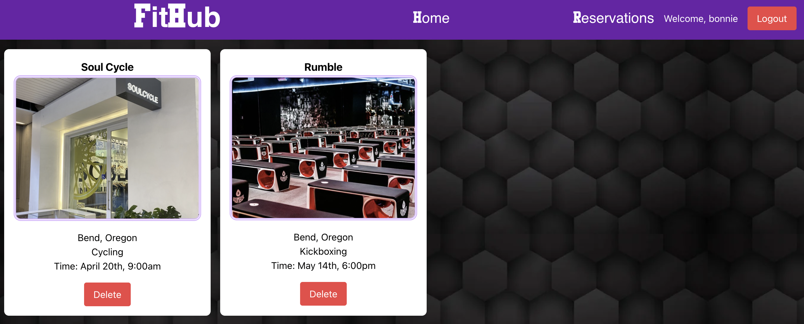
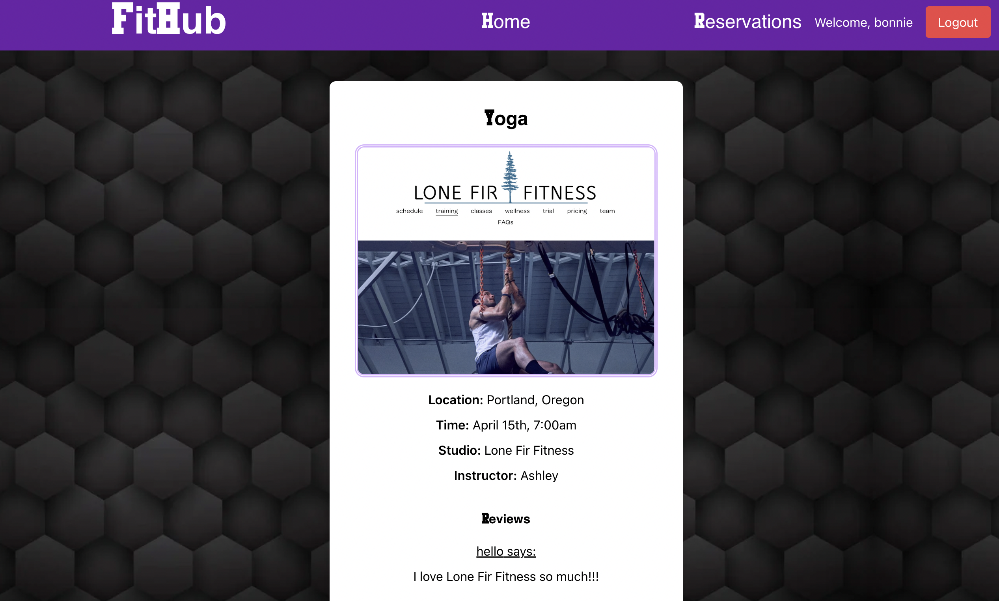

# Project-3---FitHub🧘‍♀️🤸‍♂️💪🥊

## FitHub

Take care of all your class tracking needs with our new app, FITHUB! Manage your entire workout schedule seamlessly to ensure that you never miss a class. Our app enables users to add all of their workout classes easily, as well as review them with a few simple clicks! What are you waiting for, start using FitHub now!

## Technologies Used:

- React  
- Tailwind CSS 
- JavaScript  
- MongoDB  
- Mongoose  
- CORS  
- JWT/Bcyprt 

## Resources:

- Lecture Notes  
- Stack Overflow  
- ChatGpt  
- Tailwind CSS Documentation  

## Click to view FitHub:

https://fithub-frontend-8c32195b1449.herokuapp.com/class

https://trello.com/b/nPVrBjKJ/project-3

## Next Steps: 

- Incorporate ClassPass API into our application.

- Add an administrator role. 

## Collaborators

**Julianna Bennett**  

**Bonnie Liu**

## Show Your Support!

Feedback is greatly appreciated! Please feel free to contribute, create an issue, or ask any questions! 

Please leave a ⭐️ if you like this project! Thanks for viewing!

